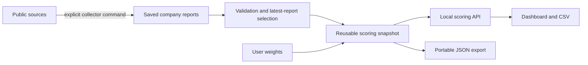

# Third-Party Risk Intelligence

Inspect vendor risk signals, see the evidence behind them, and understand how category weights and missing data affect a ranking. This repository combines public-source collection, a reusable scoring framework, and a local dashboard for the UBS AI Innovation Challenge.

**The running dashboard currently shows collector heuristic triage scores.** It does not display the synthetic AI demo or call AI models. Those separate framework workflows are available from the CLI. Higher scores mean higher risk under the selected method; a score is a prioritization signal, not proof that a vendor is unsafe.

## Start the dashboard

Use Python 3.11 or newer. There are no Python runtime dependencies or JavaScript build steps. From the repository root:

```bash
python3 serve.py
```

Open **http://127.0.0.1:8000**. Use `python3 serve.py --port 8001` if the port is occupied, and Ctrl+C to stop. Opening `index.html` directly does not provide the scoring API.

The server reads the saved reports in `companies/`; starting it does not contact evidence providers. The browser optionally loads Google Fonts, with local fallback fonts if unavailable. Searches, filters, source inspection, and reweighting work against the saved collection.

## Read the dashboard

- **Overall and category scores:** 0–100, higher means higher risk. A dash means no eligible score, not zero risk.
- **Coverage:** the fraction of requested category weight supported by eligible scores. Missing categories are excluded and available weights renormalized.
- **Weights:** change one dimension and the other weights rebalance to total 100%. The server calculates the resulting scores; the browser does not duplicate scoring formulas.
- **Evidence:** select a vendor or subscore to inspect findings, citations, publisher/retrieval dates, source checks, and collection errors.
- **Refresh:** every 30 seconds while enabled and the tab is visible, the browser checks saved files. This does not collect new external evidence. Failed refreshes retain the previous view with an error and disable CSV export.
- **CSV:** exports all rows matching the current filters, across pages, with scores, coverage, requested weights, report paths, and collection timestamps.

The saved snapshot contains ten companies. Eight have sourced heuristic summaries for cybersecurity, financial, and fraud; reputational and sanctions summaries are missing. Chain IQ and HireRight remain unscored. HireRight's collection error remains visible. The financial values in these saved reports are **collector heuristics**, not the pending financial AI assessments; the synthetic demo excludes financial until those assessments arrive.

## How the pieces connect



| Component | Responsibility |
| --- | --- |
| `risk_collector/` | Fetch sourced findings; write dated JSON and Markdown reports |
| `companies/<id>/` | Company identity and saved reports; directory names are stable IDs |
| `risk_framework/` | Validate inputs, summarize assessments, calculate scores/coverage/ranges, rank results |
| `serve.py` | Local asset server, validated snapshot cache, `GET /api/dashboard` |
| `index.html`, `app.js`, `styles.css` | Render server results and evidence; manage filters and weight preferences |
| `examples/` | Demonstration weights/config and fictional repeated-assessment inputs |
| `schemas/` | Input, scoreboard, portable website, and dashboard API contracts |
| `tests/` | Offline calculation, validation, CLI, collector-parser, and HTTP tests |

The server uses [collection_config.json](examples/collection_config.json) and [collection_weights.json](examples/collection_weights.json). Policy defaults live in [defaults.json](risk_framework/defaults.json). Categories and weights are configurable in the scoring layer. The collector's supported categories live in its registry and model.

## Three scoring modes

| Mode | Inputs | Overall headline | Disagreement range | Used by the dashboard? |
| --- | --- | --- | --- | --- |
| Collector triage | One sourced heuristic summary per category | Weighted category scores | None | Yes |
| Synthetic assessment demo | 100 generated values per available non-financial category | Median of 5,000 weighted Monte Carlo draws | Injected synthetic spread | CLI/export only |
| Supplied AI assessments | Repeated canonical assessments from the upstream team | Monte Carlo median by default | Supplied AI disagreement | CLI/export only |

The framework preserves category results and missing-data flags in every mode. Real repeated assessments normally require at least 10 runs and flag counts below 100. Triage explicitly uses a single summary and never fabricates an uncertainty range. Synthetic values are labeled throughout the payload and cannot be mixed with real assessments in a website dataset.

Repeated AI judgments are not independent measurements of objective truth. A p10–p90 band describes assessment disagreement, **not a statistical confidence interval**. Synthetic spread is chosen demo noise. [FRAMEWORK.md](docs/FRAMEWORK.md) explains the formulas, assumptions, and thresholds.

## Generate and score 100 synthetic assessments

These commands are offline. They write reproducible demo inputs and a portable website payload; **they do not change what `serve.py` displays**.

```bash
python3 -m risk_framework simulate \
  --reports companies \
  --config examples/collection_config.json \
  --output exports/simulated-assessments.json

python3 -m risk_framework export \
  --reports companies \
  --weights examples/collection_weights.json \
  --config examples/collection_config.json \
  --assessments exports/simulated-assessments.json \
  --output exports/risk-data.json
```

With the saved collection, this produces 1,600 demo assessments: eight companies × cybersecurity/fraud × 100 runs. Financial is excluded by configuration; other missing findings remain missing. Scored entities have 50% requested-weight coverage with the example weights. The output labels `score_basis` as `simulated_ai_assessments` and contains the Monte Carlo median, p10/p90, stability, and a separate weighted category reference.

For a portable export of the current dashboard's collector data, omit `--assessments` and choose `--output exports/collector-triage.json`. For real agent output, replace the synthetic file path with the canonical JSON/JSONL supplied by the upstream team. Do not mix the two input types. Generated exports are ignored by Git and can be reproduced using these commands.

## Collect fresh evidence

Collection is explicit and requires network access; dashboard refresh and weight changes do not trigger it. List collectors without making provider requests:

```bash
python3 -m risk_collector --list-collectors
```

To refresh a company, configure the SEC contact information where applicable and run:

```bash
export RISK_COLLECTOR_USER_AGENT="Your Org risk-team you@yourorg.com"
python3 -m risk_collector \
  --company-file companies/microsoft/company.json \
  --out companies/microsoft
```

The dashboard picks up the latest saved report on its next successful check. Provider errors remain in that report; a newer incomplete report does not silently fall back to older evidence. See [DATA_COLLECTION.md](docs/DATA_COLLECTION.md) for source selection, report layout, caching, and caveats.

## Verify and develop

```bash
python3 -m unittest discover -s tests -v
```

The Python suite uses synthetic fixtures, saved reports, and temporary localhost servers; it does not query external providers. If Node.js is available, also check JavaScript syntax and the request/control logic (Node 18+):

```bash
node --check app.js
node --test tests/dashboard_logic.test.cjs
```

| Guide | What it explains |
| --- | --- |
| [ARCHITECTURE.md](docs/ARCHITECTURE.md) | Module boundaries, data flow, configuration, and extension points |
| [DASHBOARD.md](docs/DASHBOARD.md) | UI behavior, API requests/errors, cache refresh, and troubleshooting |
| [DATA_COLLECTION.md](docs/DATA_COLLECTION.md) | Company inputs, collectors, provenance, reports, and refresh operations |
| [FRAMEWORK.md](docs/FRAMEWORK.md) | Scoring formulas, missing data, Monte Carlo, reproducibility, and limitations |
| [WEBSITE_DATA.md](docs/WEBSITE_DATA.md) | JSON fields, entity joins, export commands, and integration examples |

The server binds only to localhost and exposes dashboard assets plus the read-only API. It is a hackathon development server, not an authenticated production service. There is no database, scheduled collection, agent orchestration, or UBS internal integration.
